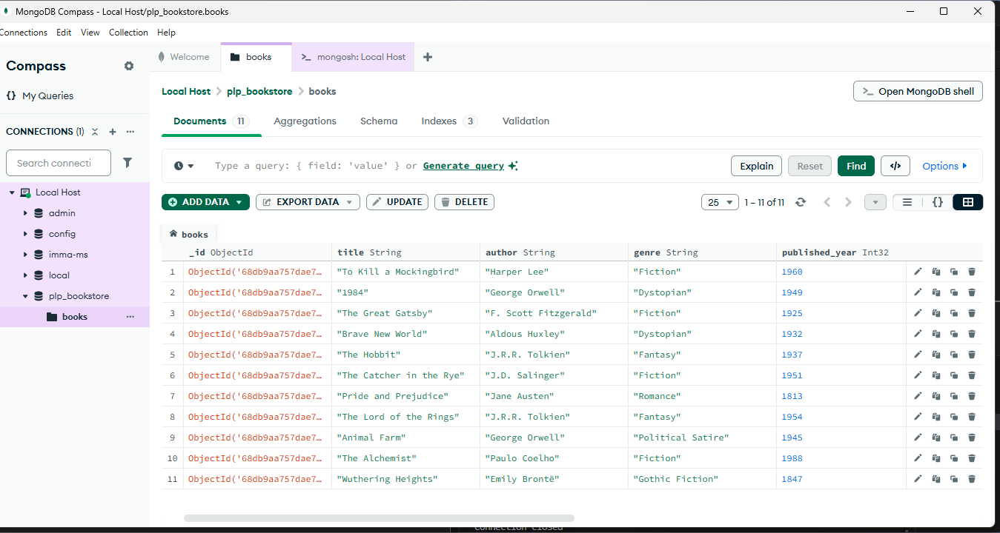

# MongoDB Fundamentals – Week 1 Assignment

## 📦 Project Overview

This project demonstrates MongoDB data layer fundamentals and advanced techniques, including:
- Database setup and connection
- CRUD operations
- Advanced queries (filtering, projection, sorting, pagination)
- Aggregation pipelines
- Indexing for performance

All code and queries are in [insert_books.js](insert_books.js) and [queries.js](queries.js).

## 🛠️ Setup Instructions

1. **Install MongoDB Community Edition**  
   [Installation Guide](https://www.mongodb.com/docs/manual/administration/install-community/)

2. **Install Node.js**  
   [Download Node.js](https://nodejs.org/)

3. **Initialize your Node.js project**  
   In your project directory, run:
   ```sh
   npm init -y
   ```

4. **Install dependencies**  
   Install the MongoDB Node.js driver:
   ```sh
   npm install mongodb
   ```

5. **Create a `.gitignore` file**  
   To avoid committing `node_modules` and other unnecessary files, add:
   ```
   node_modules/
   ```
   to your `.gitignore`.

6. **Populate the database**  
   Run the following command to insert sample book data:
   ```sh
   node insert_books.js
   ```

7. **Run queries and aggregation pipelines**  
   Execute all queries and indexing tasks:
   ```sh
   node queries.js
   ```

## 📂 Files Included

- [insert_books.js](insert_books.js): Script to insert sample book data
- [queries.js](queries.js): All MongoDB queries, aggregations, and indexing
- [SETUP_INSTRUCTIONS.md](SETUP_INSTRUCTIONS.md): Troubleshooting and setup help
- [Week1-Assignment.md](Week1-Assignment.md): Assignment details
- [examples/](examples/): Example scripts for MongoDB connection and shell usage
- [screenshots/](screenshots/): Visual evidence of your work

## 🖼️ Screenshots

### MongoDB Compass – Collections and Sample Data


### MongoDB Shell – Query Output


### Indexes Created


## 📚 Resources

- [MongoDB Documentation](https://docs.mongodb.com/)
- [MongoDB Node.js Driver](https://mongodb.github.io/node-mongodb-native/)
- [MongoDB University](https://university.mongodb.com/)

---
For any issues, see [SETUP_INSTRUCTIONS.md](SETUP_INSTRUCTIONS.md).